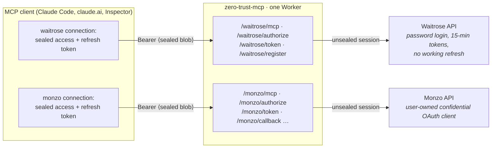
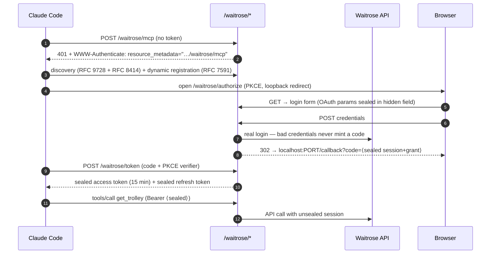
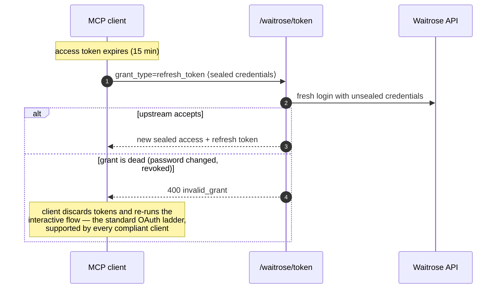

# zero-trust-mcp

**A remote MCP server that stores no third-party credentials or user data.** Credentials live AES-256-GCM-sealed *inside the OAuth tokens the MCP client itself holds*. Monzo and Yoto add small refresh coordinators whose only durable values are a generation number and one-way token hash—state that cannot call an upstream API.

Each integration gets its own path with a complete, standalone OAuth 2.1 lifecycle:

```
https://<worker>/waitrose/mcp     ← real grocery API, username/password upstream
https://<worker>/demo/mcp         ← runnable fake OAuth provider
https://<worker>/monzo/mcp        ← real Monzo API, user-supplied OAuth client
https://<worker>/yoto/mcp         ← Yoto developer API, user-supplied OAuth client
```

Connecting with the real Claude CLI just works:

```
$ claude mcp add --transport http waitrose https://<worker>/waitrose/mcp
$ claude mcp list
waitrose: https://<worker>/waitrose/mcp (HTTP) - ! Needs authentication
# /mcp → authenticate → login form → …
waitrose: https://<worker>/waitrose/mcp (HTTP) - ✔ Connected

> Use the waitrose tools to check what's in my trolley
⏺ waitrose - get_trolley()
  ⎿ Duchy Organic Chicken Breast Fillets, Yeo Valley Whole Milk, … total £47.30
```

To launch Claude with **only Monzo** for one session, without loading any of
your other configured MCP servers:

```sh
claude --strict-mcp-config \
  --mcp-config '{"mcpServers":{"monzo":{"type":"http","url":"https://zero-trust-mcp.templestein.workers.dev/monzo/mcp"}}}'
```

Claude opens the OAuth flow when the server first authenticates. The Monzo
handoff page waits for in-app approval, confirms that `/accounts` is usable,
then gives one clear **Return to your MCP client** button.

Built on Cloudflare Workers with the [MCP TypeScript SDK v2 beta](https://github.com/modelcontextprotocol/typescript-sdk) and the [jonastemplestein/waitrose](https://github.com/jonastemplestein/waitrose) package.

## Why

Remote MCP servers are becoming the way agents reach third-party APIs. The default architecture is uncomfortable: a hosted MCP server that proxies to upstream APIs normally keeps a **database of everyone's upstream credentials** — refresh tokens, sometimes passwords. That database is a breach magnet, an operational liability, and a trust problem ("why does this random connector service have my grocery password in its Postgres?").

This project explores the other extreme: **the client holds the capability.** OAuth already forces MCP clients to hold an access token and a refresh token, send them back on requests, and replace them on refresh. If those tokens are encrypted blobs *containing the upstream credentials*, the server can unseal state from each request, act on it, and hand back updated state without retaining a usable third-party capability. The Monzo and Yoto hash-only coordinators prevent concurrent refresh races without retaining a credential.

The crypto pattern is old and sound — it's how [oauth2-proxy](https://oauth2-proxy.github.io/oauth2-proxy/) seals sessions into cookies and how Rails encrypts session cookies — but as far as we could find, nobody had written it up for MCP.

## The architecture

One worker serves every integration, but each integration path is an **independent authorization-server + resource-server pair**. There is no shared session, no shared grant, no coupling: a token sealed for `/waitrose` is cryptographically garbage at `/monzo`.



Every artifact the server issues is the same construction: `base64url( version ‖ 96-bit IV ‖ AES-256-GCM ciphertext )` under the single `SEAL_KEY`. GCM gives integrity, so a blob handed to an untrusted party can be trusted when it comes back. Expiry, the integration id (audience), and PKCE bindings live *inside* the plaintext.

### What's sealed where

| Artifact | Sealed contents | TTL |
|---|---|---|
| `client_id` | the registered `redirect_uris` (stateless dynamic client registration) | ∞ |
| authorize state | the validated OAuth params, riding through the login form (hidden field) or the upstream provider (`state` param) | 10 min |
| connection handoff | the upstream session + grant, held in a sealed browser field while a provider-specific approval finishes | 10 min |
| authorization code | upstream session + grant + PKCE challenge + redirect_uri | 2 min |
| **access token** | the upstream *session* (what a request needs) | upstream's expiry |
| **refresh token** | the durable *grant* (what can mint sessions): credentials for password integrations, the upstream refresh token for OAuth ones | ∞ |

The access/refresh split is the heart of the design. The access token holds only what a request needs. The refresh token holds what can create new sessions — and the refresh grant is the *only* moment the protocol lets the server hand new state to the client, so that's exactly where upstream re-authentication happens.

### The connect flow



For an OAuth-style upstream such as Monzo, steps 5–7 are replaced by a redirect to the provider's consent screen, with our sealed state riding through the provider's `state` parameter; the callback exchanges the provider's code server-side. Either way the *shape* the MCP client sees is identical.

### The refresh / recovery lifecycle

The Waitrose upstream expires tokens after 15 minutes and its refresh mutation doesn't work — re-login is the only path. That's invisible to the user:



No custom client behavior is required anywhere: expiry-driven refresh, 401-driven refresh, and `invalid_grant`-driven re-authorization are the three rungs of the ladder every MCP client already implements.

## Lessons learned: why one path per integration (and not scopes)

The first version of this repo multiplexed all integrations behind a single `/mcp` endpoint, with OAuth **scopes as the integration set** and a `connect_integration` meta-tool that answered **403 `insufficient_scope`** to trigger a scope step-up re-authorization (SEP-2350), plus a sealed browser cookie so re-auth only prompted for the new integration. It was elegant and it worked perfectly — against a test client written to the spec.

Real MCP clients (July 2026) don't do scope step-up. They treat the 403 as a hard failure and force a full re-authentication instead of escalating scopes, which turns "connect another integration" into "reconnect everything, confusingly." The lesson: **the only OAuth behaviors you can rely on across today's MCP clients are the basics** — discovery from a 401 challenge, dynamic registration, PKCE, refresh grants, and `invalid_grant` → re-authorize.

Path-per-integration needs nothing else, and it's simpler everywhere: no scopes, no meta-tools, no wizard, no cookie, ~40% less code. Each connection has one integration, one lifecycle, one failure domain. Clients show each integration as its own named server with its own tool list, which is also just... better UX. (The multiplexed version lives in git history if you want to see it — `git log --all --oneline`.)

## Repo layout

```
src/
  index.ts               path router + per-request MCP server factory     (~120 lines)
  oauth.ts               the entire stateless authorization server        (~380 lines)
  seal.ts                AES-256-GCM seal/unseal                          (~70 lines)
  html.ts                shared provider-themed login + completion pages
  integrations/
    types.ts             Integration contract, presentation + completion hooks
    waitrose/
      index.ts           package adapter: login, catalogue, trolley, order details, account
    yoto/
      index.ts           OAuth adapter + MYO cards, library groups, player inventory
      client.ts          bounded HTTP requests and token validation
      coordinator.ts     hash-only refresh serialization
    monzo/
      index.ts           OAuth adapter + tools
      coordinator.ts     hash-only refresh serialization
dummy-oauth/
  src/index.ts           fake OAuth provider used by the runnable demo
test/
  journey.ts             legacy fixture journey: PKCE, refresh, audience binding
  browser-proof.ts       drives the login page in headless Chrome via agent-browser
```

### Adding an integration

One folder, one object, one line in the registry. Password-style:

```ts
export const thing: PasswordIntegration = {
  id: "thing", name: "Thing", kind: "password",
  fields: [{ name: "username", label: "Email", type: "email" }, /* … */],
  login: async (creds, env) => ({ session, expiresInSeconds, grant: creds }),
  refreshGrant: (grant, env) => /* re-login with the sealed credentials */,
  registerTools(server, session) { server.registerTool("do_it", /* … */); },
};
```

OAuth-style integrations swap `login`/`fields` for `authorizeUrl`/`exchangeCode`. Add one to the `integrations` map in `src/index.ts` and it's live at `/thing/mcp` with the complete OAuth lifecycle — discovery, registration, login page, refresh, recovery.

Monzo is the third supported shape: `user-client-oauth`. Each user supplies their own confidential upstream client during authorization. See [the verified design and threat model](docs/monzo-zero-trust-research.md).

Provider UX is declarative too. An integration may provide `presentation`
(logo, wordmark, colors, setup copy) and an optional `connectionFlow`:

```ts
connectionFlow: {
  instructionTitle: "Approve in the provider app",
  pendingTitle: "Still waiting",
  readyTitle: "Provider is connected",
  // remaining button/body copy omitted
  check: async (session, env) => canReadData(session, env) ? "ready" : "pending",
}
```

The shared OAuth engine seals the browser handoff, serves
`/<provider>/complete`, polls readiness, renders pending/ready/error states,
and returns the authorization code to the MCP client. Provider folders never
implement those protocol or page mechanics. That keeps the extension unit to
one adapter object and one registry entry even if the catalogue grows large.

The `grant` is whatever your integration needs to mint future sessions: credentials for password APIs (like Waitrose, where refresh doesn't work), the upstream refresh token for OAuth APIs (like Gmail would be). It's sealed into the refresh token and never stored.

## Waitrose checkout

Tools: `search_products`, `get_trolley`, `add_to_trolley`, `remove_from_trolley`,
`get_orders`, `get_order`, `get_account_info`, `get_current_slot`, `list_slot_dates`,
`list_slots`, `book_slot`, `get_checkout`, and `place_order`.

Book a slot, review `get_checkout`, then authorize the order before calling
`place_order` with the reviewed order ID and estimated total/currency. The library
refreshes order context and checks eligibility and totals before submitting once.
An unknown outcome must be checked with `get_order` before retrying. Accounts
requiring payment setup or challenges use the returned Waitrose checkout URL.

The Waitrose dependency is pinned to the checkout implementation's Git commit
until a package release includes it. [Library APK research](https://github.com/jonastemplestein/waitrose/blob/2e25adb653ccc4153727f86e1b824fe56e75e99d/docs/checkout-research.md)
records the native instant-checkout endpoint. No live purchase was used to test it.
Run `bun test/waitrose-tools.ts` for the MCP-to-library contract checks.

## Yoto

Yoto has a [public developer API](https://yoto.dev/api/) and existing community
MCP servers. This adapter brings it into the same hosted, sealed-credential
model as the other integrations. [Research and API references](docs/yoto-research.md)
document the public API and Android APK evidence used for playback.

1. Create a **confidential** application at [dashboard.yoto.dev](https://dashboard.yoto.dev/).
2. Set the allowed callback to `https://<worker>/yoto/callback`.
3. Enable `family:library:view user:content:manage family:devices:view family:devices:control offline_access`.
4. Add `https://<worker>/yoto/mcp` to your MCP client. Enter your developer client
   ID and secret in the setup form, then sign in and consent on Yoto's site.

```sh
claude mcp add --transport http yoto https://<worker>/yoto/mcp
```

Tools: `list_players`, `list_library`, `get_library_card`, `list_myo_cards`,
`get_card`, `list_library_groups`, `get_library_group`, `create_streaming_card`,
`play_card`, `pause_playback`, `resume_playback`, `stop_playback`, `set_volume`,
and `set_sleep_timer`. Play supports chapter/track selection and seeking;
volume uses 0–100 percent. Commands report API acceptance, not device execution.
Existing connections must enable `family:devices:control` and reconnect.

Streaming cards take public HTTPS MP3/AAC URLs and need internet during playback;
link them to physical MYO cards in the Yoto app. Local audio uploads and live
playback state/acknowledgements over MQTT are not included.

`bun run test:yoto` exercises OAuth, all tools, concurrent refresh and storage
boundaries against a fake provider using the real Worker. **A real Yoto account
has not been used for validation.** Deployment includes the new Yoto Durable
Object binding and `v2` migration in `wrangler.jsonc`.

## Running it

Prerequisites: [bun](https://bun.sh), a Cloudflare account, `wrangler` logged in (set `CLOUDFLARE_ACCOUNT_ID` if your token spans several accounts).

```sh
bun install

# each Worker's only secret configuration: a 32-byte sealing key
openssl rand -base64 32 | bunx wrangler secret put SEAL_KEY -c dummy-oauth/wrangler.jsonc
openssl rand -base64 32 | bunx wrangler secret put SEAL_KEY

bunx wrangler deploy -c dummy-oauth/wrangler.jsonc
# Put that URL in wrangler.jsonc as DEMO_PROVIDER_URL, then:
bunx wrangler deploy
```

For local dev put `SEAL_KEY=…` in `.dev.vars` (gitignored). The `global_fetch_strictly_public` compatibility flag lets the public Worker call the demo Worker when both use the same Cloudflare account.

Prove everything against your deployment (the Waitrose leg needs a real login):

```sh
bun test/journey.ts https://zero-trust-mcp.<you>.workers.dev you@example.com yourpassword
```

Or connect the real thing:

```sh
claude mcp add --transport http waitrose https://zero-trust-mcp.<you>.workers.dev/waitrose/mcp
claude   # → /mcp → waitrose → Authenticate
```

## Spec compliance

Implements the [MCP authorization spec (2025-06-18)](https://modelcontextprotocol.io/specification/2025-06-18/basic/authorization) per integration path: RFC 9728 protected-resource metadata (advertised via `WWW-Authenticate` on 401), RFC 8414 authorization-server metadata with path-insertion discovery for the path-scoped issuers, RFC 7591 dynamic client registration, PKCE S256 (enforced, verified in tests), refresh grants, audience-bound tokens (the integration id is sealed in and checked), and port-agnostic loopback redirect matching for CLI clients (RFC 8252). Verified end-to-end against Claude Code's real OAuth implementation.

## Honest limitations (read before using for anything real)

- **Authorization codes are not single-use.** With no storage there's nothing to burn a code against. Mitigations: 2-minute TTL + PKCE binding (a replayed code needs the same verifier).
- **No local revocation list.** A sealed access token is valid until it expires. Upstream revocation still propagates on API use or refresh, and rotating `SEAL_KEY` is a global kill-switch—which also logs out every user.
- **Monzo and Yoto refresh recovery is intentionally limited.** The hash-only coordinator prevents concurrent rotations but cannot recover a newly rotated refresh token if the successful response is lost. That case requires interactive OAuth again.
- **A live Worker can see tokens in flight.** The design protects credentials at rest; it cannot protect against an actively malicious or compromised deployment serving the request.
- **Sealed credentials live in client hands.** For password integrations, the user's password sits AES-sealed inside the refresh token in the MCP client's token store. The crypto is sound; your threat model must be comfortable with ciphertext-at-rest outside your infrastructure — and with `SEAL_KEY` being the one secret that matters. It *is* the database now; guard it accordingly.
- **Password-kind integrations are a workaround, not a virtue.** Waitrose has no OAuth, so the login form is the only way in. For upstreams with real OAuth (Gmail, etc.) the oauth-kind integration keeps passwords out of the picture entirely — the sealed grant is just the upstream refresh token.
- **The MCP SDK v2 is beta** (`2.0.0-beta.1`); stable is expected 2026-07-28 alongside the new spec revision.

## Prior art & references

- [cloudflare/workers-oauth-provider](https://github.com/cloudflare/workers-oauth-provider) — Kenton Varda's OAuth library for Workers. Its props-encryption design inspired parts of this, but it hard-requires KV: no secrets stored, but state is.
- [oauth2-proxy](https://oauth2-proxy.github.io/oauth2-proxy/) — seals upstream tokens into browser cookies; the closest non-MCP relative of this design.
- [FastMCP's OAuth proxy](https://gofastmcp.com/servers/auth/oauth-proxy) — the stateful version of the upstream-token-wrapping pattern (Redis/DynamoDB + Fernet).
- [MCP authorization spec](https://modelcontextprotocol.io/specification/2025-06-18/basic/authorization) · [MCP TypeScript SDK v2](https://github.com/modelcontextprotocol/typescript-sdk) · [RFC 9728](https://www.rfc-editor.org/rfc/rfc9728) · [RFC 8414](https://www.rfc-editor.org/rfc/rfc8414) · [RFC 7591](https://www.rfc-editor.org/rfc/rfc7591)

## License

MIT

---

*Built with [Claude Code](https://claude.com/claude-code) as an exploration of stateless MCP architecture. It works — a real Claude Code instance completed the OAuth flow and read a real grocery trolley through it — but treat it as a design document with a running proof, not a product.*
