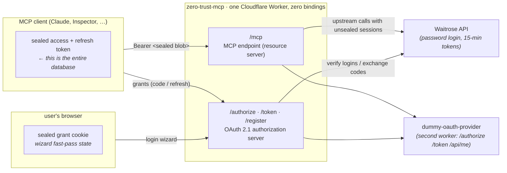
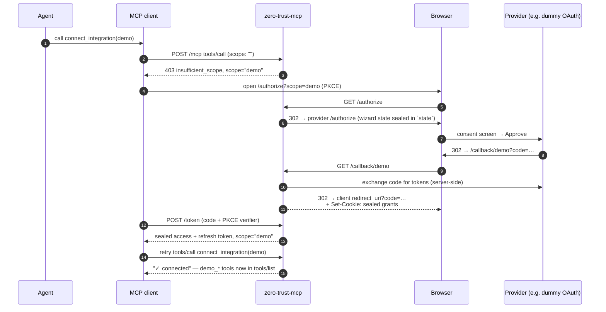
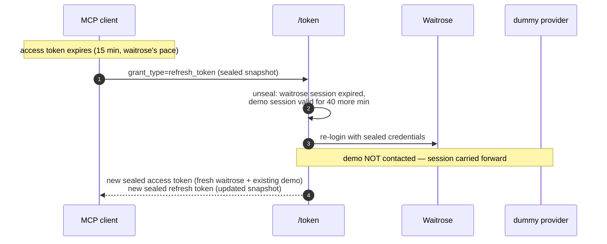

# zero-trust-mcp

**A remote MCP server that stores nothing.** No database, no KV, no sessions — the credentials and tokens for every third-party integration live AES-256-GCM-sealed *inside the OAuth tokens the MCP client itself holds*. The server's only piece of configuration is one 32-byte key.

Built on Cloudflare Workers with the [MCP TypeScript SDK v2 beta](https://github.com/modelcontextprotocol/typescript-sdk). Ships with two integrations: [Waitrose](https://github.com/jonastemplestein/waitrose) (a real, username/password grocery API) and a deliberately tiny fake OAuth provider (a second worker, for demonstrating the full OAuth-to-OAuth flow).

```
$ bun test/multiplex.ts https://zero-trust-mcp.example.workers.dev me@example.com hunter2

=== 1. initial connect — no scopes ===
  tools: connect_integration                      ← the only tool
=== 2. connect_integration(demo) ===
  → 403 insufficient_scope, re-authorizing with scope="demo"
  tools: connect_integration, demo_whoami, disconnect_integration, list_integrations
=== 3. connect_integration(waitrose) ===
  → 403 insufficient_scope, re-authorizing with scope="demo waitrose"
  ✓ wizard showed ONLY the waitrose form (demo fast-passed from sealed cookie)
  tools: … demo_whoami … waitrose_search_products, waitrose_get_trolley …
```

## Why

Remote MCP servers are becoming the way agents reach third-party APIs. The default architecture is uncomfortable: a hosted MCP server that proxies to upstream APIs normally keeps a **database of everyone's upstream credentials** — refresh tokens, sometimes passwords. That database is a breach magnet, an operational liability, and a trust problem ("why does this random connector service have my Gmail refresh token in its Postgres?").

This project explores the other extreme: **the client is the database.** OAuth already forces MCP clients to hold an access token and a refresh token and to send them back on every request and refresh. If those tokens are encrypted blobs containing the upstream credentials, the server needs *zero storage* — it unseals state from each request, acts on it, and (at refresh time) hands back updated state. The client can't read the blobs; the server can't act without being handed them. Neither side alone holds usable credentials. Hence: zero trust.

The pattern is old and sound — it's how [oauth2-proxy](https://oauth2-proxy.github.io/oauth2-proxy/) seals sessions into cookies and how Rails encrypts session cookies — but as far as we could find, nobody had written it up for MCP.

## The architecture



One worker is simultaneously the **OAuth 2.1 authorization server** (it issues the tokens) and the **MCP resource server** (it consumes them) — the MCP auth spec explicitly allows this. Every artifact it issues is the same thing: `base64url( version ‖ 96-bit IV ‖ AES-256-GCM ciphertext )` under the single `SEAL_KEY`. GCM gives integrity, so a blob handed to an untrusted party can be trusted when it comes back. Expiry, type tags, and PKCE bindings live *inside* the plaintext.

### What's sealed where

| Artifact | Sealed contents | Held by |
|---|---|---|
| `client_id` | the registered `redirect_uris` (stateless dynamic client registration) | MCP client |
| wizard state (`wiz`) | OAuth params + integrations collected so far, 10-min TTL | in flight (form field / upstream `state` param) |
| authorization code | the full collected bundle + PKCE challenge + redirect_uri, 2-min TTL | in flight |
| **access token** | per-integration *sessions* (upstream access tokens), `exp` = soonest upstream expiry | MCP client |
| **refresh token** | per-integration *grants* (credentials / upstream refresh tokens) **and** still-valid sessions (a snapshot) | MCP client |
| grant cookie | per-integration grants from previous wizard runs, 90 days | user's browser |

The split between access and refresh token matters: the access token holds only what a request needs; the refresh token holds what can *mint* new sessions. A refresh grant is the one moment the server can write new state back to the client — so that's where upstream refreshes happen.

## Scopes are integrations

The granted OAuth scope set *is* the list of connected integrations. `scope: "waitrose demo"` = a bundle with both. This makes everything else fall out of standard OAuth machinery:

- **A fresh connection has no integrations.** The server deliberately doesn't advertise `scopes_supported`, so clients authorize with an empty scope. The wizard has nothing to collect and instantly redirects back — the user sees nothing. The resulting token grants exactly one tool: `connect_integration`.
- **Connecting an integration is a scope step-up.** Calling `connect_integration({integration: "waitrose"})` while `waitrose` isn't in the granted scope makes the server answer **HTTP 403** with `WWW-Authenticate: Bearer error="insufficient_scope", scope="demo waitrose"` ([SEP-2350](https://modelcontextprotocol.io/specification/draft/basic/authorization)). A compliant client re-runs the authorization flow with the advertised scope, the wizard collects only what's missing, and the retried tool call succeeds with the new token.
- **Disconnecting is a step-down** — the same 403 with the *reduced* scope set.
- **Tools appear and disappear with the token.** The MCP SDK v2's per-request server factory rebuilds the tool surface on every request from whatever the bearer token contains. No session, no registry — the token *is* the configuration.



## The wizard: multi-integration consent with zero server state

`/authorize` is a chain: one step per requested integration — a password form for `kind: "password"` integrations, a redirect out to the provider for `kind: "oauth"` ones. Progress rides in a sealed `wiz` blob (hidden form field, or the OAuth `state` parameter through upstream providers). Each step unseals it, appends the collected grant, re-seals, and passes it along. The final step mints the authorization code from the accumulated bundle.

The trick that makes step-up UX painless is the **sealed browser cookie**. Every completed wizard sets a 90-day cookie containing the grants it collected — sealed with the same key, unreadable by the browser. When a re-authorization comes through (step-up, step-down, or recovery after upstream revocation), the wizard first tries to satisfy each requested integration *from the cookie*, contacting the upstream to verify the grant still works. Only integrations it can't fast-pass show UI. Connecting your second integration therefore asks for exactly one login, and a disconnect re-auth is fully invisible.

The server still stores nothing — this state lives in the *user's browser*, which is allowed to remember its own user.

## Snapshot refresh tokens

Different upstreams expire at different rates (Waitrose: 15 minutes and its refresh mutation doesn't work, so re-login is the only path; the dummy provider: 1 hour with proper refresh tokens). The bundle's `expires_in` is the *minimum* across integrations, so the client refreshes on the fastest-expiring upstream's schedule.

A naive design would re-contact every upstream on every refresh. Instead the refresh token is a **snapshot**: it carries each integration's durable grant *and* its current session with expiry. The refresh handler reuses sessions that are still comfortably valid and only refreshes what's actually near expiry:



If one upstream's refresh fails, the bundle **degrades instead of dying**: that integration is marked with an error (visible via `list_integrations`, retried on a later refresh), while every other integration keeps working. Transient upstream failures never destroy grant material; only an explicit re-authorization replaces it.

## The meta-tools

| Tool | Available | Mechanism |
|---|---|---|
| `connect_integration` | always | 403 step-up → wizard → retried call confirms |
| `disconnect_integration` | when ≥1 connected | 403 step-down with reduced scope |
| `list_integrations` | when ≥1 connected | pure read of the unsealed token: status, expiry, degraded flags |
| `waitrose_*`, `demo_*` | per granted scope | rebuilt per request from the sealed sessions |

## Repo layout

```
src/
  index.ts               router, step-up interception, per-request MCP server factory
  oauth.ts               the entire stateless authorization server (~450 lines)
  seal.ts                AES-256-GCM seal/unseal (~70 lines)
  html.ts                wizard login page + index page
  integrations/
    types.ts             Integration interface (password | oauth kinds)
    waitrose/
      client.ts          vendored verbatim from jonastemplestein/waitrose (dependency-free)
      index.ts           login + 6 tools
    demo/
      index.ts           OAuth-kind integration against the dummy provider (~70 lines)
dummy-oauth/
  src/index.ts           the fake provider: /authorize, /token, /api/me (~140 lines)
  wrangler.jsonc
test/
  multiplex.ts           scripted MCP client WITH step-up support — the full journey
  browser-proof.ts       drives the login page in headless Chrome via agent-browser
```

### Adding an integration

An integration is a folder exporting one object. Password-style:

```ts
export const thing: PasswordIntegration = {
  id: "thing", name: "Thing", kind: "password",
  fields: [{ name: "username", label: "Email", type: "email" }, …],
  login: async (creds, env) => ({ session, expiresInSeconds, grant: creds }),
  refreshGrant: (grant, env) => /* re-login */,
  registerTools(server, session) { server.registerTool("thing_do_it", …); },
};
```

OAuth-style integrations swap `login`/`fields` for `authorizeUrl` / `exchangeCode` (see `integrations/demo`). Register it in `src/index.ts`'s `integrations` map — scope handling, wizard steps, cookie fast-pass, refresh, and the meta-tools all pick it up automatically.

## Running it

Prerequisites: [bun](https://bun.sh), a Cloudflare account, `wrangler` logged in.

```sh
bun install

# each worker needs its own 32-byte sealing key (the ONLY configuration)
openssl rand -base64 32 | bunx wrangler secret put SEAL_KEY -c dummy-oauth/wrangler.jsonc
openssl rand -base64 32 | bunx wrangler secret put SEAL_KEY

bunx wrangler deploy -c dummy-oauth/wrangler.jsonc     # note the URL it prints…
# …and put it in wrangler.jsonc's DEMO_PROVIDER_URL var, then:
bunx wrangler deploy
```

If your Cloudflare token spans multiple accounts, set `CLOUDFLARE_ACCOUNT_ID`. For local dev, put `SEAL_KEY=...` in `.dev.vars` (gitignored). Note `global_fetch_strictly_public` in `wrangler.jsonc`: without it, Cloudflare blocks a worker fetching another worker's `workers.dev` URL on the same account (error 1042).

Prove the whole journey against your deployment (needs a real Waitrose login):

```sh
bun test/multiplex.ts https://zero-trust-mcp.<you>.workers.dev you@example.com yourpassword
```

Or connect a real client: `claude mcp add --transport http shopping https://zero-trust-mcp.<you>.workers.dev/mcp`.

## Spec compliance

Implements the [MCP authorization spec (2025-06-18)](https://modelcontextprotocol.io/specification/2025-06-18/basic/authorization): RFC 9728 protected-resource metadata (+ `WWW-Authenticate` pointers on 401), RFC 8414 authorization-server metadata, RFC 7591 dynamic client registration, PKCE S256 (enforced), refresh grants with rotation, port-agnostic loopback redirect matching for CLI clients (RFC 8252), and SEP-2350 scope step-up. Legacy (2025-era) MCP clients are served by the SDK's stateless fallback; 2026-07-28-era clients get the modern per-request envelope.

## Honest limitations (read before using for anything real)

Statelessness has real costs. Known, deliberate gaps:

- **Authorization codes are not single-use.** OAuth 2.1 wants replay-proof codes; with no storage there's no way to burn one. Mitigations: 2-minute TTL + PKCE binding (a replayed code needs the same verifier).
- **No revocation.** A sealed token is valid until it expires. Upstream revocation still works (refresh fails → re-auth), and rotating `SEAL_KEY` is a global kill-switch — which also logs out every user. Version the key (a prefix byte already exists) if you need graceful rotation.
- **The cookie fast-pass is silent auto-consent.** Anyone who can register a client (DCR is open, per the MCP spec's recommendation) and get a user to *click an authorize link* in the browser holding the grant cookie gets a token for that user's integrations — PKCE doesn't help because the attacker owns the client. A production version must show a consent screen ("Continue connecting Waitrose + Demo for <client>?") whenever a fast-pass occurs, and should display the requesting client's identity.
- **Sealed credentials exist in more places.** The user's password (for password-kind integrations) sits AES-sealed inside the refresh token in the client's token store and inside a browser cookie. The crypto is sound, but your threat model must be comfortable with ciphertext-at-rest in client hands — and with `SEAL_KEY` being the single secret that matters. Put it in HSM-grade secret storage; it *is* the database now.
- **Scope step-up (SEP-2350) client support is uneven** (July 2026). The scripted test client implements it; check your target MCP clients. Everything else here degrades gracefully to the universal 401 → refresh → re-authorize ladder plus a manual "reconnect".
- **The MCP SDK v2 is beta** (`2.0.0-beta.1`); stable is expected 2026-07-28 alongside the new spec revision.

## Prior art & references

- [cloudflare/workers-oauth-provider](https://github.com/cloudflare/workers-oauth-provider) — Kenton Varda's OAuth library for Workers. Its props-encryption design (secrets encrypted under token-derived keys) inspired parts of this, but it requires KV: it's "half-stateless" (no secrets stored, but state is).
- [oauth2-proxy](https://oauth2-proxy.github.io/oauth2-proxy/) — seals upstream tokens into browser cookies; the closest non-MCP relative of this design.
- [FastMCP's OAuth proxy](https://gofastmcp.com/servers/auth/oauth-proxy) — the stateful version of the upstream-token-wrapping pattern (Redis/DynamoDB + Fernet).
- [MCP authorization spec](https://modelcontextprotocol.io/specification/2025-06-18/basic/authorization) · [MCP TypeScript SDK v2](https://github.com/modelcontextprotocol/typescript-sdk) · [RFC 9728](https://www.rfc-editor.org/rfc/rfc9728) · [RFC 8414](https://www.rfc-editor.org/rfc/rfc8414) · [RFC 7591](https://www.rfc-editor.org/rfc/rfc7591)
- The Waitrose client is vendored verbatim from [jonastemplestein/waitrose](https://github.com/jonastemplestein/waitrose).

## License

MIT

---

*Built in an afternoon with [Claude Code](https://claude.com/claude-code) as an exploration of stateless MCP architecture. It works — the test transcript at the top is real — but treat it as a design document with a running proof, not a product.*
